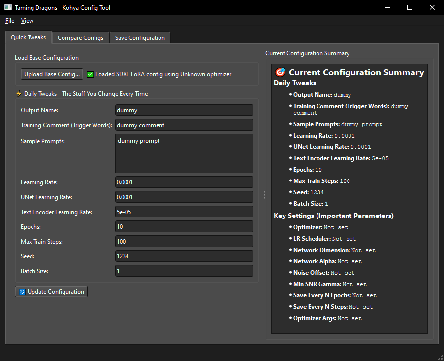
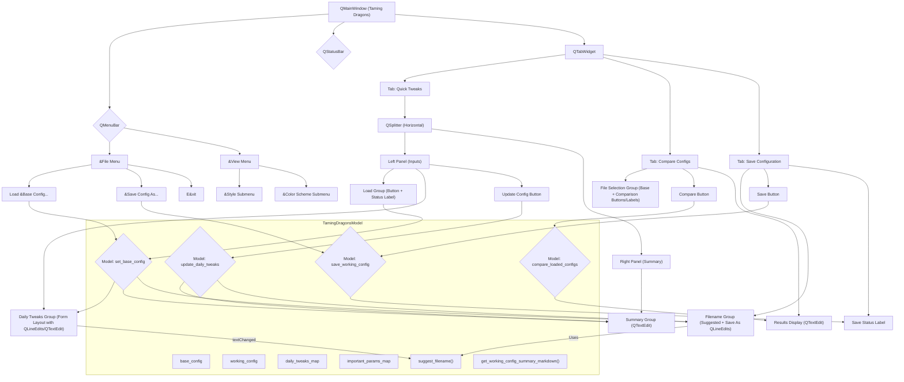

<!-- TINS Specification v1.0 -->
# Kohya Config Tool - TINS Edition

## Description

This application, "Taming Dragons - Kohya Config Tool," is designed to simplify the management and modification of Kohya SS training configurations for Stable Diffusion LoRA models. It allows users to load existing JSON configuration files, make common "daily tweaks" (like output name, learning rates, epochs), compare different configurations, and save new configurations. The primary goal is to streamline the process of iterating on training setups without manually editing JSON files, reducing errors and saving time. This tool is particularly useful for users who frequently run multiple LoRA training experiments with minor adjustments to parameters.

The original tool uses Gradio for its user interface. This TINS README describes the application's functionality for regeneration using a different GUI framework as per the overarching project goals.

## Functionality

### Core Features

- **Load Base Configuration:**
    - Users can upload a `.json` file representing a Kohya SS training configuration.
    - The tool attempts to detect the type of configuration (e.g., Flux1 LoRA, SDXL LoRA, Standard LoRA) and the optimizer used.
    - Upon successful loading, a status message is displayed (e.g., "✅ Loaded SDXL LoRA config using AdamW optimizer").
    - If loading fails, an error message is shown (e.g., "❌ Error loading file: ...").
    - The loaded configuration becomes the "working configuration."
- **Display and Update Daily Tweaks:**
    - A predefined set of parameters, termed "Daily Tweaks," are displayed in input fields for easy modification. These include:
        - `output_name` (string)
        - `training_comment` (string, often used for trigger words)
        - `sample_prompts` (multiline string)
        - `learning_rate` (string, convertible to float)
        - `unet_lr` (string, convertible to float)
        - `text_encoder_lr` (string, convertible to float)
        - `epoch` (string, convertible to int)
        - `max_train_steps` (string, convertible to int)
        - `seed` (string, convertible to int)
        - `train_batch_size` (string, convertible to int)
    - Values from the loaded base configuration populate these fields.
    - Users can modify these values.
    - An "Update Configuration" button applies these changes to the working configuration.
    - A status message confirms the update (e.g., "✅ Daily tweaks updated successfully!").
    - If no base configuration is loaded, an error message is shown ("❌ Please load a base configuration first").
    - Type conversion is attempted for numeric fields (int, float) and booleans based on the original value's type in the loaded config. If conversion fails, the value is stored as a string. Empty fields are not updated.
- **Compare Configurations:**
    - Users can upload two `.json` configuration files: a "Base Configuration" and a "Comparison Configuration."
    - The tool loads both files.
    - A "Compare Configurations" button triggers the comparison.
    - The comparison result is displayed, highlighting differences in:
        - Daily Tweaks parameters.
        - "Important Parameters" (a predefined list: `optimizer`, `lr_scheduler`, `network_dim`, `network_alpha`, `noise_offset`, `min_snr_gamma`, `save_every_n_epochs`, `save_every_n_steps`).
        - Optimizer type and optimizer arguments (`optimizer_args`).
    - If configurations are very similar (no differences in these key areas), a message like "✅ **Configurations are very similar!**" is shown.
    - Status messages from loading each file are also displayed.
- **View Configuration Summary:**
    - An expandable section or area displays a summary of the current working configuration.
    - This summary includes current values for all "Daily Tweaks" and "Important Parameters."
    - It updates when a base configuration is loaded or when daily tweaks are applied.
    - If no configuration is loaded, it shows "No configuration loaded."
- **Save Configuration:**
    - Users can save the current working configuration to a new `.json` file.
    - A suggested filename is automatically generated based on the `output_name` and `training_comment` fields.
        - If `output_name` is present, it's used (e.g., `MyNewLoRA_v1` -> `MyNewLoRA_v1_config.json`).
        - Otherwise, the first two words of `training_comment` are used (e.g., `mynewlora woman` -> `mynewlora_woman_config.json`).
        - If both are empty, `modified_config.json` is suggested.
        - Non-alphanumeric characters (except `_` and `-`) are replaced with `_`.
    - Users can specify a custom filename. If it doesn't end with `.json`, the extension is appended.
    - Files are saved into a `configs` subdirectory (created if it doesn't exist).
    - A status message confirms successful save (e.g., "✅ Configuration saved as: configs/my_new_config.json") or shows an error (e.g., "❌ Error saving: ...").
    - If no configuration is loaded, an error message is shown ("❌ No configuration to save").

### User Interface (PySide6 Implementation)

The application will be built using PySide6, structured within a `QMainWindow`. A `QTabWidget` will organize the main functional areas.



**Main Window (`QMainWindow`)**
- Title: "Taming Dragons - Kohya Config Tool"
- Menu Bar (`QMenuBar`):
    - File Menu (`QMenu` "&File"):
        - Load Base Config (`QAction` "Load &Base Config...", connects to file dialog, triggers `load_base_config`)
        - Save Config (`QAction` "&Save Config As...", connects to file dialog, triggers `save_config`)
        - Exit (`QAction` "E&xit", `QKeySequence.StandardKey.Quit`, connects to `QMainWindow.close`)
    - View Menu (`QMenu` "&View"):
        - Style Submenu (`QMenu` "&Style"): Contains checkable `QAction` items for each available system style (e.g., "Fusion", "Windows"). Selected style is saved and restored.
        - Color Scheme Submenu (`QMenu` "&Color Scheme"): Contains checkable `QAction` items for "Auto", "Light", and "Dark" color schemes. Selected scheme is saved and restored.
- Status Bar (`QStatusBar`): Displays operation status and messages.

**Main Tabs (`QTabWidget`)**

**Tab 1: Quick Tweaks (`QWidget` container)**
- Main Layout: `QHBoxLayout` containing a `QSplitter`.
- **Left Panel of Splitter:** `QWidget` with `QVBoxLayout`.
    - **Group: Load Base Configuration (`QGroupBox`)**
        - Layout: `QHBoxLayout`
        - Button: `QPushButton` "Upload Base Config..."
            - On click: Opens `QFileDialog.getOpenFileName` (filter: "*.json"). Selected file path passed to `model.load_base_config`.
        - Label: `QLabel` "Status:" (read-only, updated by `model.load_base_config` result).
    - **Group: Daily Tweaks (`QGroupBox` "⚡ Daily Tweaks - The Stuff You Change Every Time")**
        - Layout: `QFormLayout`.
        - Input fields for each daily tweak parameter (e.g., `output_name` as `QLineEdit`, `sample_prompts` as `QTextEdit`).
        - Button: `QPushButton` "🔄 Update Configuration".
        - Label: `QLabel` "Update Status:" (read-only).
- **Right Panel of Splitter:** `QWidget` containing the "Current Configuration Summary".
    - **Group: Current Configuration Summary (`QGroupBox`)**
        - Layout: `QVBoxLayout`.
        - Display Area: `QTextEdit` (read-only, `setMarkdown` for formatted text).
            - Initial text: "Load a configuration to see summary."
            - Updated by `model.get_working_config_summary` after loading or updating.

**Tab 2: Compare Configs (`QWidget` container)**
- Layout: `QVBoxLayout`
- Heading: `QLabel` "Compare Two Configurations"
- Informational text: `QLabel` "Compare your base config with another to see what's different before tweaking."
- **Group: File Selection (`QGroupBox`)**
    - Layout: `QGridLayout` or `QHBoxLayout`
    - Button: `QPushButton` "Select Base Configuration..."
        - On click: `QFileDialog.getOpenFileName` for base file. Store path.
    - Label: `QLabel` for base file path (read-only).
    - Button: `QPushButton` "Select Comparison Configuration..."
        - On click: `QFileDialog.getOpenFileName` for comparison file. Store path.
    - Label: `QLabel` for comparison file path (read-only).
- Button: `QPushButton` "🔍 Compare Configurations"
    - On click: Passes stored base and comparison file paths to `model.compare_configs`.
- Display Area: `QTextEdit` "Comparison Result" (read-only, `setMarkdown` for formatted differences from `model.compare_configs`).

**Tab 3: Save Configuration (`QWidget` container)**
- Layout: `QVBoxLayout`
- Heading: `QLabel` "Save Your Modified Configuration"
- **Group: Filename (`QGroupBox`)**
    - Layout: `QFormLayout`
    - Label: `QLabel` "Suggested Filename:"
    - Display Field: `QLineEdit` (read-only, updated by `model.generate_filename_suggestion` when `output_name` or `training_comment` change in Quick Tweaks tab).
        - Example: `self.suggested_filename_label = QLineEdit()`
        - `self.suggested_filename_label.setReadOnly(True)`
    - Label: `QLabel` "Save As:"
    - Input Field: `QLineEdit` (Placeholder: "my_new_config.json"). User can type or modify suggestion.
        - Example: `self.save_as_edit = QLineEdit()`
- Button: `QPushButton` "💾 Save Configuration"
    - On click: Gets filename from the "Save As" `QLineEdit`, passes to `model.save_config`.
- Label: `QLabel` "Save Status:" (read-only, updated by `model.save_config` result).

**General UI Notes (PySide6 Specific):**
- **Feedback:** Status messages will be displayed in dedicated `QLabel` widgets near the action buttons or in the `QStatusBar`. `QMessageBox.information` or `QMessageBox.warning` for important notifications or errors.
- **File Dialogs:** `QFileDialog` will be used:
    - `QFileDialog.getOpenFileName(self, "Open Configuration File", "", "JSON files (*.json)")`
    - `QFileDialog.getSaveFileName(self, "Save Configuration File", "configs/", "JSON files (*.json)")` (Initial directory `configs/`)
- **Directory Creation:** The `configs` directory creation will be handled by `pathlib.Path.mkdir(exist_ok=True, parents=True)` within the `model.save_config` method before attempting to write the file.
- **Widget Interaction:**
    - When a base config is loaded, the daily tweak `QLineEdit` and `QTextEdit` fields will be populated.
    - `output_name_edit.textChanged.connect(self.update_suggested_filename_slot)`
    - `training_comment_edit.textChanged.connect(self.update_suggested_filename_slot)`
    - The `update_suggested_filename_slot` would call `model.generate_filename_suggestion` and update the `suggested_filename_label` in the Save tab.
- **Layout Management:** `QVBoxLayout`, `QHBoxLayout`, `QGridLayout`, `QFormLayout` will be used for arranging widgets. `QGroupBox` will be used to visually group related elements.

### Behavior Specifications

- **File Handling:**
    - All configuration files are expected to be UTF-8 encoded JSON.
    - Paths are relative to the application's execution directory, especially for saving into the `configs` subfolder.
- **Data Integrity:**
    - The "working configuration" is the primary data structure in memory. It's initialized from the base config and modified by daily tweaks.
    - When updating daily tweaks, if a field is left empty by the user, the corresponding value in the working configuration should *not* be changed (i.e., retain the value from the base config or previous update).
    - Type conversion for daily tweaks should be robust: attempt to convert to the original type (e.g., int, float from the loaded config); if it fails, store as string. Boolean conversion should handle 'true', '1', 'yes', 'on' (case-insensitive) as True.
- **Filename Generation:**
    - `generate_filename_suggestion(output_name, training_comment)`:
        - If `output_name` is provided, use it. Sanitize by replacing non-alphanumeric characters (excluding `_`, `-`) with `_`. Append `_config.json`.
        - If `output_name` is empty but `training_comment` is provided, take the first two words. Sanitize each word (remove non-alphanumeric) and join with `_`. Append `_config.json`.
        - If both are empty, return `modified_config.json`.
        - If the base (sanitized name part) is empty after processing, default to `modified_config.json`.
- **Comparison Logic:**
    - Comparison should clearly list parameters that differ between the two files, showing the value from the base and the comparison file.
    - Sections for differences: Daily Tweaks, Important Parameters, Optimizer (including `optimizer_args`).
    - If no differences are found in these specific areas, a positive confirmation message should be displayed.

## Technical Implementation

### Architecture

- **Model-View-Controller (MVC) or similar pattern is recommended.**
    - **Model (`TamingDragons` class / `model.py`):**
        - Holds `base_config`, `comparison_config`, `working_config` (dictionaries).
        - Contains lists of `daily_tweaks` and `important_params` keys and their display labels.
        - Implements all business logic:
            - `load_config(file_path)`: Loads a single JSON, detects type, returns config dict and status string.
            - `load_base_config(file_path)`: Uses `load_config` to populate `base_config` and `working_config`. Extracts values for daily tweak UI fields. Returns status and daily tweak values.
            - `compare_configs(base_file_path, comp_file_path)`: Loads both, performs comparison, returns formatted string.
            - `update_daily_tweaks(*values)`: Updates `working_config` based on input values from UI. Handles type conversion. Returns status string.
            - `get_working_config_summary()`: Generates formatted string of current `working_config` for display.
            - `save_config(filename)`: Saves `working_config` to `configs/filename`. Returns status string.
            - `generate_filename_suggestion(output_name, training_comment)`: Returns suggested filename string.
    - **View/Controller (`main.py` with PySide6):**
        - Handles UI creation and event handling.
        - Calls methods in the Model.
        - Updates UI elements based on data returned from the Model.
- **Dependencies:**
    - `PySide6` for the GUI.
    - Standard Python libraries: `json`, `os`, `pathlib`, `re`.

### Data Structures

- **Configuration files:** JSON format. Loaded into Python dictionaries.
- **`daily_tweaks`:** Dictionary mapping parameter keys (e.g., `output_name`) to display labels (e.g., `Output Name`).
  ```python
  self.daily_tweaks = {
      'output_name': 'Output Name',
      'training_comment': 'Training Comment (Trigger Words)',
      'sample_prompts': 'Sample Prompts',
      'learning_rate': 'Learning Rate',
      'unet_lr': 'UNet Learning Rate',
      'text_encoder_lr': 'Text Encoder Learning Rate',
      'epoch': 'Epochs',
      'max_train_steps': 'Max Train Steps',
      'seed': 'Seed',
      'train_batch_size': 'Batch Size'
  }
  ```
- **`important_params`:** Dictionary mapping parameter keys to display labels.
  ```python
  self.important_params = {
      'optimizer': 'Optimizer',
      'lr_scheduler': 'LR Scheduler',
      'network_dim': 'Network Dimension',
      'network_alpha': 'Network Alpha',
      'noise_offset': 'Noise Offset',
      'min_snr_gamma': 'Min SNR Gamma',
      'save_every_n_epochs': 'Save Every N Epochs',
      'save_every_n_steps': 'Save Every N Steps'
  }
  ```
- **`working_config`:** Python dictionary holding the live, modifiable configuration.

### Algorithms

- **Config Loading:**
    1. Check file existence.
    2. Open and `json.load()`.
    3. Detect config type based on key-value pairs:
        - `LoRA_type == 'Flux1'` -> "Flux1 LoRA"
        - `sdxl == True` -> "SDXL LoRA"
        - `LoRA_type == 'Standard'` -> "Standard LoRA"
        - Else "Unknown"
    4. Extract `optimizer` value.
    5. Construct status message.
- **Config Comparison:**
    1. Load both base and comparison configs.
    2. Iterate through `daily_tweaks` keys:
        - Get value from base_config (default "Not set").
        - Get value from comp_config (default "Not set").
        - If different, record the difference with labels and values.
    3. Iterate through `important_params` keys:
        - Get values and record if different.
    4. Compare `optimizer` values. If different, record.
    5. If optimizers differ, compare `optimizer_args` (default empty string). If different, record.
    6. Format all recorded differences into a markdown-like string.
- **Filename Sanitization (within `generate_filename_suggestion`):**
    - For `output_name` or words from `training_comment`: `re.sub(r'[^\w\-_]', '_', name_part)`

### External Integrations
- None beyond reading/writing files from the local filesystem. The application does not interact with Kohya SS directly or any web services.

## Style Guide (Conceptual for PySide6)

- **Layout:** Intuitive and clean. Use tabs to separate major functions. Within tabs, group related controls using group boxes or clear spacing.
- **Responsiveness:** The window should be resizable to a reasonable extent, with elements adjusting gracefully.
- **Feedback:** Status messages should be clearly visible and distinct (e.g., using color for success/error, or icons).
- **Consistency:** Use consistent terminology and widget styles throughout the application.

## Performance Requirements

- The application should be responsive, with UI updates occurring quickly after user actions.
- File loading and saving for typical configuration file sizes (usually small, <1MB) should be near-instantaneous.
- Comparison of two configs should also be very fast.

## Accessibility Requirements

- Standard keyboard navigation should be supported (Tab, Shift+Tab).
- Labels for all input fields are necessary.
- Font sizes should be legible. (Consider respecting system font settings if possible).

## Testing Scenarios

- **Load:**
    - Load a valid SDXL LoRA config. Verify status and daily tweak fields populate correctly.
    - Load a valid Standard LoRA config.
    - Load a Flux1 config.
    - Attempt to load a non-JSON file. Verify error message.
    - Attempt to load a non-existent file. Verify error message.
    - Attempt to load a JSON file that is not a Kohya config. Verify it loads but may show "Unknown" type.
- **Update Tweaks:**
    - Change `output_name` and `learning_rate`. Update. Verify summary shows new values. Save and check JSON.
    - Clear `epoch` field. Update. Verify original epoch value is retained in summary/saved file.
    - Enter non-numeric value in `seed`. Update. Verify it's stored as string (or error shown if strict typing is enforced before this stage).
- **Compare:**
    - Compare two identical files. Verify "very similar" message.
    - Compare files with different `learning_rate`. Verify difference is shown.
    - Compare files with different `optimizer`. Verify difference and `optimizer_args` (if any) are shown.
    - Compare file with itself. Verify "very similar".
- **Save:**
    - Load config, change `output_name` to "TestLoRA". Verify suggested filename is `TestLoRA_config.json`.
    - Change `training_comment` to "mychar concept". Verify suggested filename (if output_name is cleared) is `mychar_concept_config.json`.
    - Save with default suggested name. Verify file created in `configs/` dir.
    - Save with custom name "custom.json". Verify.
    - Save with custom name "custom_no_ext". Verify "custom_no_ext.json" is created.
- **Edge Cases:**
    - Try to update/save without loading a base config. Verify error messages.
    - Use special characters in `output_name` or `training_comment` and check filename suggestion sanitization.
    - Load a config, then load another. Verify the UI correctly reflects the newly loaded config.

## Security Considerations

- As the application primarily deals with local files provided by the user, the main risk would be if the JSON parsing library had a vulnerability exploited by a malicious config file. Using the standard `json` library is generally safe.
- The application writes files to a subdirectory (`configs/`). Ensure no path traversal vulnerabilities (e.g., if a filename like `../../some_other_dir/evil.json` could be used, though `pathlib` usually handles this well). The current implementation seems to place it directly under `configs/`.

## Prerequisites

- Python 3.8 or higher
- PySide6 (version 6.9.1 as specified in `requirements.txt`)

## Installation

1.  **Clone the repository (or download the source files):**
    ```bash
    git clone https://github.com/fernicar/TamingDragons_TINS_Edition
    cd https://github.com/fernicar/TamingDragons_TINS_Edition
    ```
2.  **Create a virtual environment (recommended):**
    ```bash
    python -m venv venv
    source venv/bin/activate  # On Windows: venv\Scripts\activate
    ```
3.  **Install dependencies:**
    ```bash
    pip install -r requirements.txt
    ```

## Usage

1.  **Run the application:**
    ```bash
    python main.py
    ```
2.  **Using the Tool:**
    *   **Quick Tweaks Tab:**
        *   Click "Upload Base Config..." to load an existing Kohya SS JSON configuration file. The status will be displayed.
        *   Modify parameters in the "Daily Tweaks" section.
        *   Click "Update Configuration" to apply changes to the in-memory configuration. The status of this update will be shown.
        *   The "Current Configuration Summary" (now on the right side of a splitter) will display the state of your working configuration.
    *   **Compare Configs Tab:**
        *   Use the "Select Base Configuration..." and "Select Comparison Configuration..." buttons to choose two files.
        *   Click "Compare Configurations" to see a report of the differences.
        *   Note: The "Base Configuration" for comparison is independent of the one loaded in "Quick Tweaks" unless you select the same file. For clarity, it's often best to ensure the primary config you wish to compare against is loaded in the "Quick Tweaks" tab, then select the other file in the "Comparison Configuration" field here. The comparison uses the model's main `base_config` (from Quick Tweaks) if no specific base is selected in the Compare tab.
    *   **Save Configuration Tab:**
        *   A "Suggested Filename" will appear based on your `output_name` or `training_comment` from the Quick Tweaks tab.
        *   You can type a custom name in the "Save As" field or use/modify the suggestion.
        *   Click "Save Configuration". Files will be saved in a `configs` subdirectory created in the application's root folder.
    *   **Menu Bar:**
        *   **File > Load Base Config...:** Same as the button in the "Quick Tweaks" tab.
        *   **File > Save Config As...:** Same as the button in the "Save Configuration" tab.
        *   **File > Exit:** Closes the application.
        *   **View > Style:** Allows selection from available Qt application styles (e.g., Fusion, Windows). The choice is saved.
        *   **View > Color Scheme:** Allows selection of "Auto", "Light", or "Dark" color schemes. The choice is saved.

## TINS in Practice - A Reflection

This project serves as a practical example of the [TINS](https://github.com/ScuffedEpoch/TINS) methodology in action. The detailed [`README.md`](TINS_Edition/README.md) acted as the "source," which the AI interpreted to generate the implementation.

**Key Takeaways:**

*   **Acceleration:** Using a detailed TINS specification allowed the AI to generate a complex application structure rapidly, saving significant initial development time.
*   **Human-in-the-Loop:** Implement Test-Driven Development (TDD) TINS, AI code generation, even from detailed specs, often requires human oversight for debugging, refinement, platform-specific nuances (like GUI event loops vs. blocking calls), and ensuring adherence to best practices.
*   **Specification is Key:** The quality of the generated code is highly dependent on the clarity, detail, and consistency of the TINS `README.md`. Ambiguities in the spec can lead to unexpected or incorrect implementations.
*   **Potential:** The TINS approach, combined with capable AI assistants, shows promise for streamlining software development, especially for well-defined applications. It shifts focus from writing boilerplate code to designing and specifying robustly.

This repository demonstrates one workflow for leveraging TINS and AI. We encourage peers and mentors to review the code and the process, hopefully sparking further interest and experimentation with this development paradigm.

## Community

This project is part of the larger [ThereIsNoSource.com](https://thereisnosource.com) initiative. You can connect with other TINS developers and stay updated through the main TINS community channels:
*   [Join the Discord](https://discord.com/invite/uubQXhwzkj)

## Contributing

Contributions are welcome! If you would like to contribute, please refer to the core [TINS Contributing Guidelines](https://github.com/ScuffedEpoch/TINS/blob/main/CONTRIBUTING.md) and follow standard GitHub pull request workflows.

## Aknowledgments
*   Special thanks to ScuffedEpoch for the TINS methodology and the initial example.
*   Thanks to the free tier AI assistant for its initial contribution to the project.
*   Research LLM Gemini2.5flash (free tier beta testing) from Google AI Studio.

This project builds upon the foundations of the following projects:
- [TINS Edition](https://ThereIsNoSource.com) - TINS Specification platform that enables:
  - Complete application reconstruction from specification
  - Self-documenting architecture through detailed markdown
  - Future-proof design adaptable to advancing LLM capabilities
  - Progressive enhancement support as LLM technology evolves
  - Platform-agnostic implementation guidelines
  - Flexible technology stack selection within specified constraints
  - Comprehensive behavioral specifications for consistent rebuilds
  - Automatic adaptation to newer LLM models and capabilities
- [DragonDiffusionbyBoyo/TamingDragons](https://github.com/DragonDiffusionbyBoyo/TamingDragons) **Original repository:**
- **Libraries used:**
    - [PySide6](https://pypi.org/project/PySide6/) (v6.9.1) – GUI framework
    - [json](https://docs.python.org/3/library/json.html) – Standard Python library for JSON handling
    - [os](https://docs.python.org/3/library/os.html) – Standard Python library for OS operations
    - [pathlib](https://docs.python.org/3/library/pathlib.html) – Standard Python library for filesystem paths
    - [re](https://docs.python.org/3/library/re.html) – Standard Python library for regular expressions
    - [typing](https://docs.python.org/3/library/typing.html) – Standard Python library for type hints
    - The open-source Kohya SS project and its community

## License

This project is licensed under the MIT License - see the [LICENSE](LICENSE) file for details.

<!-- ZS:PLATFORM:DESKTOP -->
<!-- ZS:LANGUAGE:PYTHON -->
<!-- ZS:UI_FRAMEWORK:PYSIDE6 -->
<!-- ZS:FILE_FORMAT:JSON -->